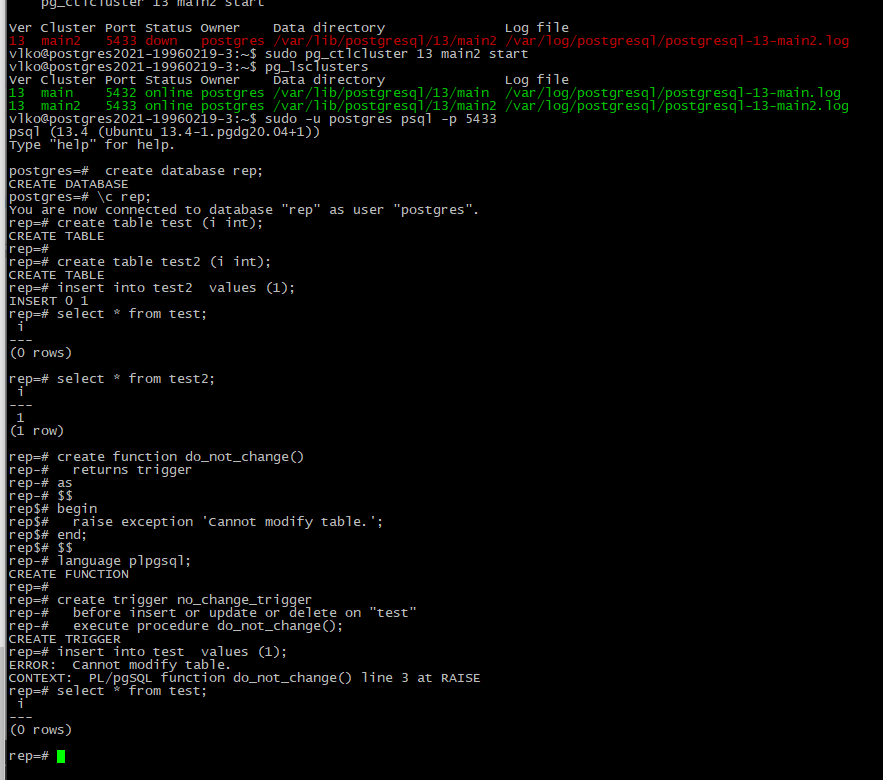

# Цель:

- реализовать свой миникластер на 3 ВМ.

# Выполнение:

- На 1 ВМ создаем таблицы test для записи, test2 для запросов на чтение.

  - Воспользовался проектом с прошлых заданий

  - 

  - создал database rep

  - две таблички тест и тест2

  - добавил запись в таблицу

  - для таблицы тест2 создал триггер, который не дает изменять таблицу

  - > create function do_not_change()
    >   returns trigger
    > as
    > $$
    > begin
    >   raise exception 'Cannot modify table.';
    > end;
    > $$
    > language plpgsql;
    >
    > create trigger no_change_trigger
    >   before insert or update or delete on "test2"
    >   execute procedure do_not_change();

  - 

- Создаем публикацию таблицы test и подписываемся на публикацию таблицы test2 с ВМ №2.

  - ALTER SYSTEM SET wal_level = logical;
  -  sudo pg_ctlcluster 13 main restart
  -  CREATE PUBLICATION test_pub FOR TABLE test;
  - 
  - подпишусь на изменения после работы на втором кластере.

- На 2 ВМ создаем таблицы test2 для записи, test для запросов на чтение. 

  - создал второй кластер sudo pg_createcluster -d /var/lib/postgresql/13/main2 13 main2
  - 
  - и запустил его
  - 
  - повторил действия с первого класстера на втором, за тем исключением, что тригер на отказ доступа изменений добавил к 1 таблице, а значение добавил во вторую
  - 

- Создаем публикацию таблицы test2 и подписываемся на публикацию таблицы test1 с ВМ №1. 

  - на втором кластере ALTER SYSTEM SET wal_level = logical;
  - sudo pg_ctlcluster 13 main2 restart
  - CREATE PUBLICATION test2_pub FOR TABLE test2;
  - 
  - CREATE SUBSCRIPTION test_sub
  - CONNECTION 'host=localhost port=5432 user=postgres password=123 dbname=rep' 
  - PUBLICATION test_pub WITH (copy_data = true);
  - 

- подписываемся на публикацию таблицы test2 с ВМ №2.

  - CREATE SUBSCRIPTION test2_sub
  - CONNECTION 'host=localhost port=5433 user=postgres password=123 dbname=rep' 
  - PUBLICATION test2_pub WITH (copy_data = true);
  - 
  - проверил что данные обновляются добавив 12
  - 

- 3 ВМ использовать как реплику для чтения и бэкапов (подписаться на таблицы из ВМ №1 и №2 ). 

  - создал третий кластер sudo pg_createcluster -d /var/lib/postgresql/13/main3 13 main3 и запустил его
  - 
  - создал database и таблицы
  - 
  - CREATE SUBSCRIPTION test2_sub
  - CONNECTION 'host=localhost port=5433 user=postgres password=123 dbname=rep' 
  - PUBLICATION test2_pub WITH (copy_data = true);
  - CREATE SUBSCRIPTION test_sub
  - CONNECTION 'host=localhost port=5432 user=postgres password=123 dbname=rep' 
  - PUBLICATION test_pub WITH (copy_data = true);
  - попытался подписаться не получилось
  - 
  - ALTER SYSTEM SET wal_level = logical;
  - sudo pg_ctlcluster 13 main3 restart
  - 

- Небольшое описание, того, что получилось.

  - создал три кластера и настроил логическую репликацию между ними

---

- реализовать горячее реплицирование для высокой доступности на 4ВМ. Источником должна выступать ВМ №3. Написать с какими проблемами столкнулись.
  - задание со * на данный момент не стал выполнять, возможно вернусь позже

