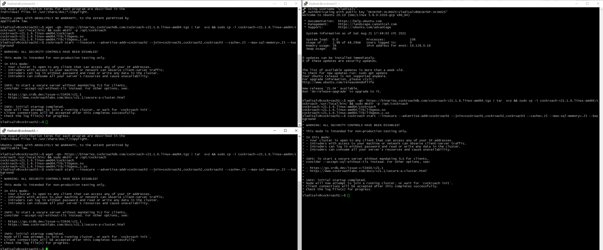

# Цель:

- развернуть multi master кластер PostgreSQL своими руками
- развернуть PostgreSQL like географически распределенный сервис от одного из 3-х крупнейших облачных провайдеров - AWS, GCP и Azure

# Выполнение:

1 вариант: Развернуть CockroachDB в GKE или GCE Потесировать dataset с чикагскими такси Или залить 10Гб данных и протестировать скорость запросов в сравнении с 1 инстансом PostgreSQL Описать что и как делали и с какими проблемами столкнулись

2 вариант: Переносим тестовую БД 10 Гб в географически распределенный PostgeSQL like сервис Описать что и как делали и с какими проблемами столкнулись

---

- Выбрал 1 вариант

---

- создал проекты

- 

- 

- gcloud compute ssh cockroach1
  gcloud compute ssh cockroach2
  gcloud compute ssh cockroach3

- 

- wget -qO- https://binaries.cockroachdb.com/cockroach-v21.1.6.linux-amd64.tgz | tar  xvz && sudo cp -i cockroach-v21.1.6.linux-amd64/cockroach /usr/local/bin/ && sudo mkdir -p /opt/cockroach

- 

- cockroach start --insecure --advertise-addr=cockroach1 --join=cockroach1,cockroach2,cockroach3 --cache=.25 --max-sql-memory=.25 --background
  cockroach start --insecure --advertise-addr=cockroach2 --join=cockroach1,cockroach2,cockroach3 --cache=.25 --max-sql-memory=.25 --background
  cockroach start --insecure --advertise-addr=cockroach3 --join=cockroach1,cockroach2,cockroach3 --cache=.25 --max-sql-memory=.25 --background

- 

- cockroach init --insecure --host=cockroach1

- 

- cockroach init --insecure --host=cockroach1

- 

- загрузил данные на вирталку gsutil -m cp -R gs://hacker_full .

- 

- создал табличку

- CREATE TABLE hacker_news_full
  (title text,
  url text,
  text text,
  dead BOOLEAN,
  by text,
  score INTEGER,
  time INTEGER,	
  timestamp TIMESTAMP,
  type text,
  id INTEGER,
  parent INTEGER,
  descendants INTEGER,
  ranking INTEGER,
  deleted BOOLEAN);

- 

- COPY hacker_news_full
  (title,
  url,
  text,
  dead,
  by,
  score,
  time,
  timestamp,
  type,
  id,
  parent,
  descendants,
  ranking,
  deleted)
  FROM PROGRAM 'awk FNR-1 /home/vlko/hhacker_full/*.csv | cat' DELIMITER ',' CSV HEADER;

- однако получил ошибку, данная на данный момент не реализована

- 

- воспользовался import INTO hacker_news_full (title,url,text,dead,by,score,time,timestamp,type,id,parent,descendants,ranking,deleted) CSV DATA ('gs://hacker_full/hacker_full_000000000000.csv') WITH DELIMITER = ',', SKIP = '1';

- 

- однако получил ошибку так как в csv есть не заполненые поля для bool

- сгенерировал таблицу на 10_000_000 записей

- create table test as

  select generate_series, (random() * 70), date'2019-01-01' + (random() * 300)::int as order_date

  ​    , (array['returned', 'completed', 'placed', 'shipped'])[(random() * 4)::int]

  ​    , concat_ws(' ', (array['go', 'space', 'sun', 'London'])[(random() * 5)::int]

  ​      , (array['the', 'capital', 'of', 'Great', 'Britain'])[(random() * 6)::int]

  ​      , (array['some', 'another', 'example', 'with', 'words'])[(random() * 6)::int]

  ​      )

  from generate_series(1, 10000000);

- 

- select count(*) from test;

- 

- команда заняла 2.517 сек

- создал инстанс для сравнения скорости

- 

- sudo apt update && sudo apt upgrade -y && sudo sh -c 'echo "deb http://apt.postgresql.org/pub/repos/apt $(lsb_release -cs)-pgdg main" > /etc/apt/sources.list.d/pgdg.list' && wget --quiet -O - https://www.postgresql.org/media/keys/ACCC4CF8.asc | sudo apt-key add - && sudo apt-get update && sudo apt-get -y install postgresql && sudo apt install unzip

- 

- \timing

- ``` sql
  create table test as
  select generate_series, (random() * 70), date'2019-01-01' + (random() * 300)::int as order_date
        , (array['returned', 'completed', 'placed', 'shipped'])[(random() * 4)::int]
        , concat_ws(' ', (array['go', 'space', 'sun', 'London'])[(random() * 5)::int]
            , (array['the', 'capital', 'of', 'Great', 'Britain'])[(random() * 6)::int]
            , (array['some', 'another', 'example', 'with', 'words'])[(random() * 6)::int]
            )
  from generate_series(1, 10000000); 
  ```

- 

- генерация таблицы заналяа 26 секунд вместо 90

- select count(*) from test;

- 

- поиск занял 760 мс вместо 2517

-  

- удаление так же быстрее на 1 инстансе
