# Цель:

- научиться пользоваться PostgreSQL based и like сервисами в Azure, GCP, AWS, ЯО

1 вариант: Воспользоваться PostgreSQL based и like сервисами в AWS. Описать что и как делали и с какими проблемами столкнулись 

2 вариант: Воспользоваться PostgreSQL based и like сервисами в GCP. Описать что и как делали и с какими проблемами столкнулись 

3 вариант: Воспользоваться PostgreSQL based и like сервисами в Azure. Описать что и как делали и с какими проблемами столкнулись 

4 вариант: Воспользоваться PostgreSQL based и like сервисами в ЯО. Описать что и как делали и с какими проблемами столкнулись

# Выполнение:

---

Выбрал 2 варинат: GCP

---

- создал инстанс
- 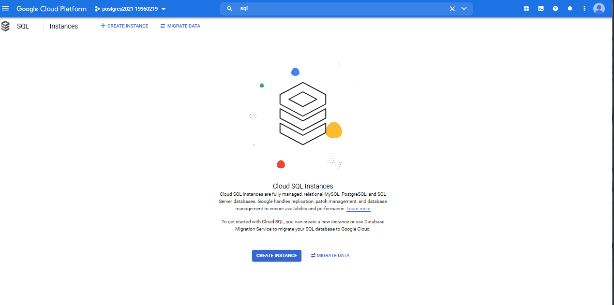
- 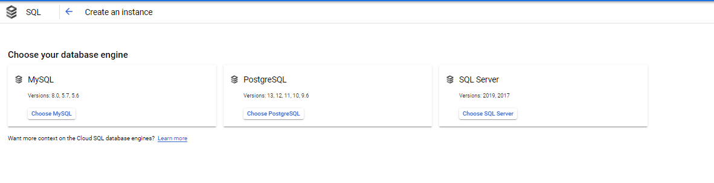
- fG4BPJlKyB0CjtMm
- 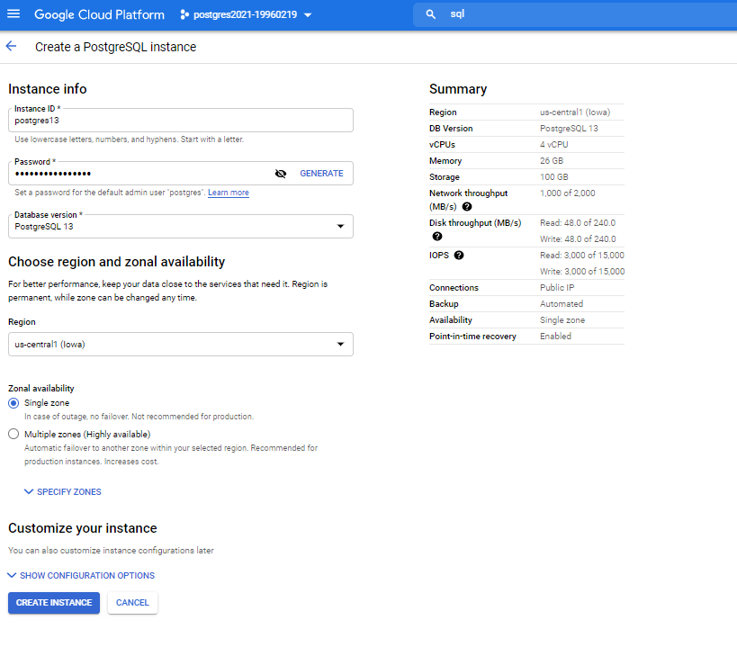
- 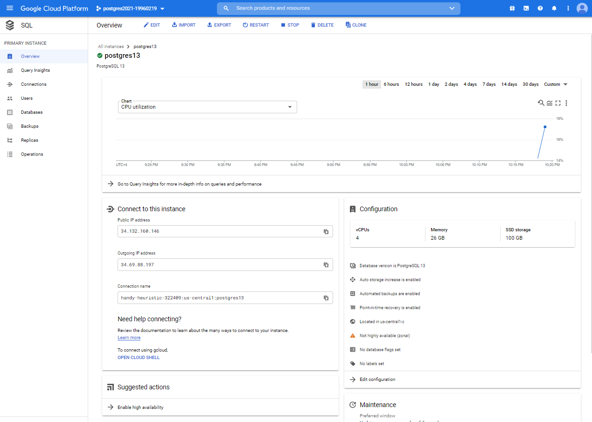
- настроил сеть
- 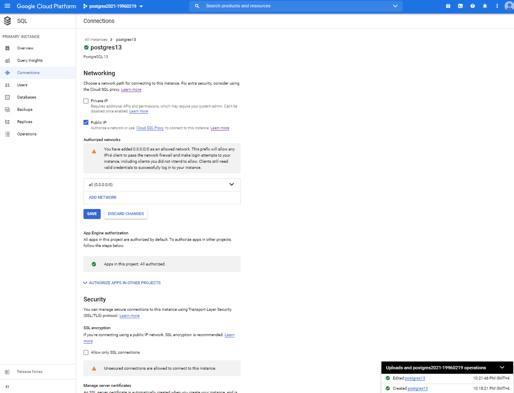
- подключился через pgAdmin
- создал табличку тест
- 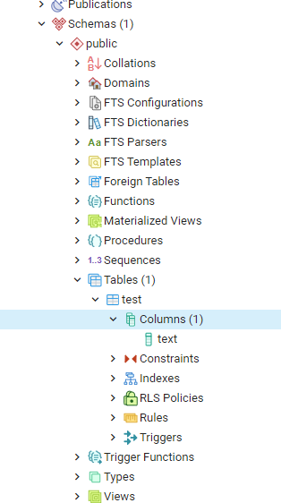
- создал базу данных taxi
- 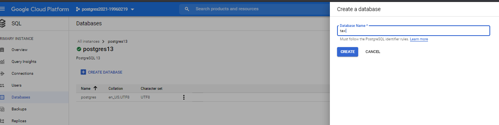
- создал табличку для такси
- 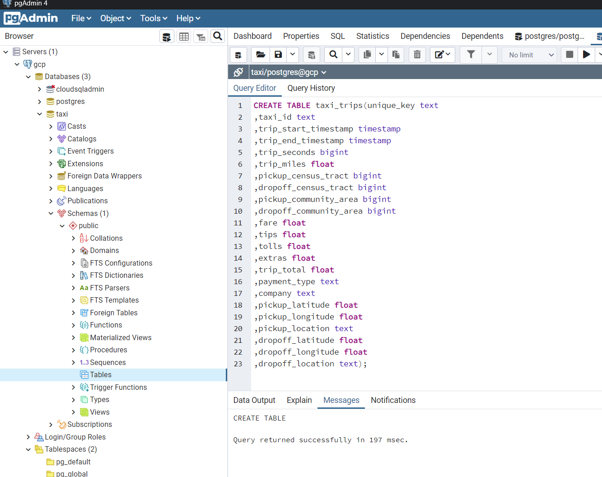
- импортировал csv
- 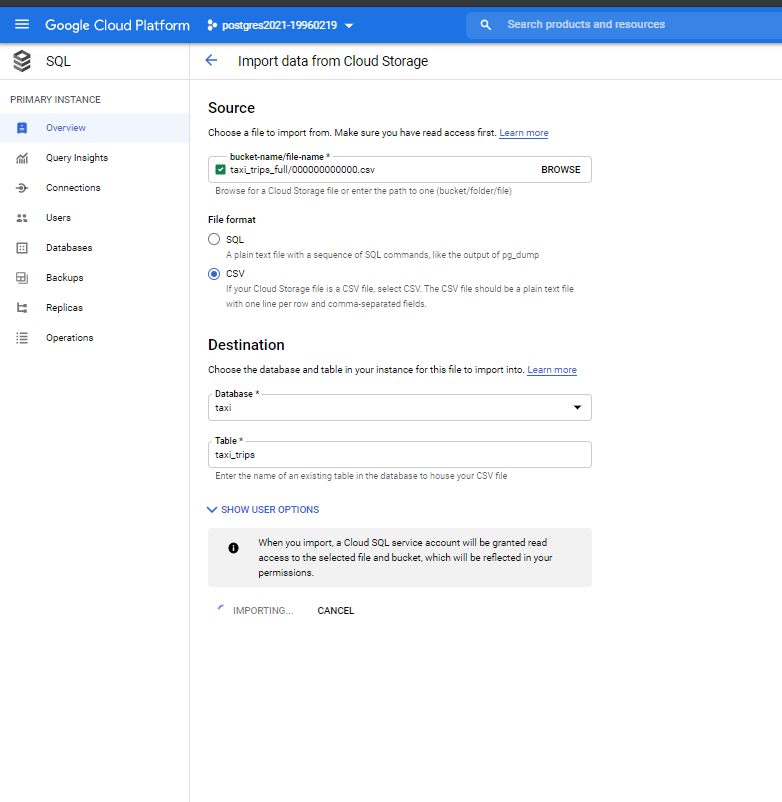
- упал с ошибкой
- 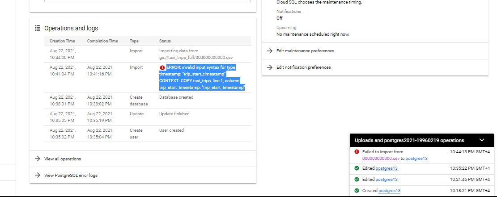
- после нескольких неудачных попыток заменил все поля на text
- 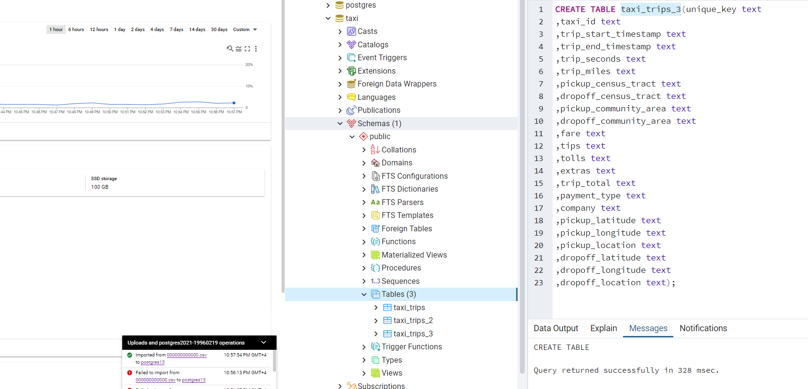
- данные успешно скопировались
- 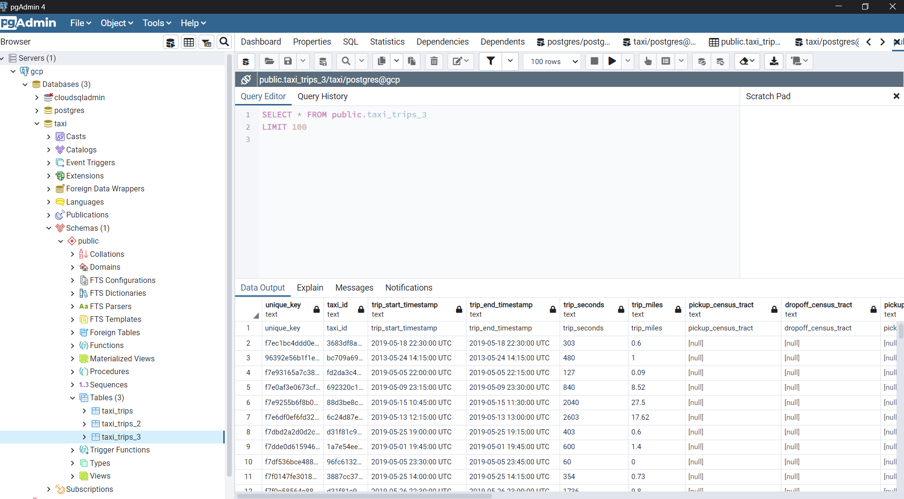
- как оказалось проблема была в хедере csv

