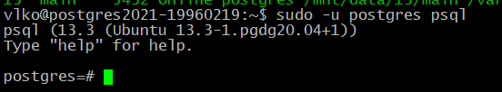

# Работа с базами данных, пользователями и правами

# Цель:

- создание новой базы данных, схемы и таблицы
- создание роли для чтения данных из созданной схемы созданной базы данных
- создание роли для чтения и записи из созданной схемы созданной базы данных

# Выполнение

- создайте новый кластер PostgresSQL 13 (на выбор - GCE, CloudSQL)
  - воспользовался инстансом с предыдущих заданий
  - 
  - 
  - остановил докер с прошлого задания
  - 
  - проверил запущен ли кластер pg_lsclusters
  - 
- зайдите в созданный кластер под пользователем postgres
  - sudo -u postgres psql
  - 
- создайте новую базу данных testdb 
  -  CREATE DATABASE testdb;
  - 
- зайдите в созданную базу данных под пользователем postgres 
  - \c testdb
  - 
- создайте новую схему testnm
  - CREATE SCHEMA testnm;
  - 
- создайте новую таблицу t1 с одной колонкой c1 типа integer
  - CREATE TABLE t1 (с1 int);
  - 
- вставьте строку со значением c1=1 
  - INSERT INTO t1(с1) VALUES (1);
  - 
- создайте новую роль readonly 
  - CREATE ROLE readonly;
  - 
  - 
- дайте новой роли право на подключение к базе данных testdb 
  - \h CREATE ROLE
  - 
  - ALTER ROLE readonly WITH login;
  - 
- дайте новой роли право на использование схемы testnm 
  - grant connect on database testdb TO readonly;
  - 
- дайте новой роли право на select для всех таблиц схемы testnm 
  - grant select on all tables in schema testnm TO readonly;
  - 
- создайте пользователя testread с паролем test123 
  - create user testread with password 'test123';
  - 
- дайте роль readonly пользователю testread 
  - grant readonly TO testread;
  - 
- зайдите под пользователем testread в базу данных testdb
  - \c testdb testread
  - 
  -  sudo nano /etc/postgresql/13/main/pg_hba.conf
  - заменил peer на md5
  - 
  - однако не смог зайти так как у пользователя postgres не было пароля
  - 
  - но даже после изменений под кастомным юзером войти не получилось
  - 
  - просмотрел список ролей
  - 
  - удалось подключиться командой  psql -U testread -h 127.0.0.1 testdb
  -  
- сделайте select * from t1; 
  - 
- получилось? (могло если вы делали сами не по шпаргалке и не упустили один существенный момент про который позже) 
  - нет
- напишите что именно произошло в тексте домашнего задания 
  - не хватило прав
- у вас есть идеи почему? ведь права то дали? 
  - по умолчанию таблица находится в public, а мы дали права на testnm
- посмотрите на список таблиц 
  - \dt
  - 
- подсказка в шпаргалке под пунктом 
  - +
- а почему так получилось с таблицей (если делали сами и без шпаргалки то может у вас все нормально) 
  - явно не указали схему
- вернитесь в базу данных testdb под пользователем postgres 
  - 
- удалите таблицу t1
  - drop table t1;
  - 
- создайте ее заново но уже с явным указанием имени схемы testnm
  - create table testnm.t1(c1 integer); 
  - 
  - 
- вставьте строку со значением c1=1 
  - insert into testnm.t1 values(1);
  - 
- зайдите под пользователем testread в базу данных testdb 
  - 
- сделайте select * from testnm.t1; 
  - 
- получилось? есть идеи почему? если нет - смотрите шпаргалку 
  - нет, так как таблица новая и к ней доступ не давали
- как сделать так чтобы такое больше не повторялось? если нет идей - смотрите шпаргалку 
  - дать доступ ко всем таблицам, а не к какой то конкретной
  - \c testdb postgres; alter default privileges in schema testnm grant select on tables to readonly; \c testdb testread;
- сделайте select * from testnm.t1; 
  - 
- получилось? 
  - нет
- есть идеи почему? если нет - смотрите шпаргалку
  - надо сделать снова или grant select или пересоздать таблицу
  - 
- сделайте select * from testnm.t1; 
  - 
- получилось? 
  - да
- ура! 
- теперь попробуйте выполнить команду create table t2(c1 integer); insert into t2 values (2); 
  - 
- а как так? нам же никто прав на создание таблиц и insert в них под ролью readonly? 
  - пока что не знаю
- есть идеи как убрать эти права? если нет - смотрите шпаргалку
  - просмотрел шпаргалку 
  - \c testdb postgres; revoke create on schema public from public; revoke all on database testdb from public; \c testdb testread; 
  - 
- если вы справились сами то расскажите что сделали и почему, если смотрели шпаргалку - объясните что сделали и почему выполнив указанные в ней команды
  -  REVOKE CREATE ON SCHEMA public FROM PUBLIC -- отменяет привилегию CREATE для PUBLIC схемы у всех пользователей (кроме владельца и суперпользователя)
  - https://www.postgresql.org/docs/9.4/ddl-schemas.html#DDL-SCHEMAS-PRIV
- теперь попробуйте выполнить команду create table t3(c1 integer); insert into t2 values (2); 
  - 
- расскажите что получилось и почему
  - добавить новую таблицу не получилось, так как отменили привилегию CREATE для PUBLIC схемы
  - однако добавить запись у нас получилось, так как grant на все действия с PUBLIC дается роли PUBLIC, а  роль PUBLIC добавляется всем новым пользователям. Устранили мы только создание, следовательно у нас остались права на добавление.

