# Цель:

- запустить нагрузочный тест pgbench с профилем нагрузки DWH
- настроить параметры autovacuum для достижения максимального уровня устойчивой производительности

# Выполнение:

- создать GCE инстанс типа e2-medium и standard disk 10GB

  - Воспользовался инстансом с прошлых заданий
  - 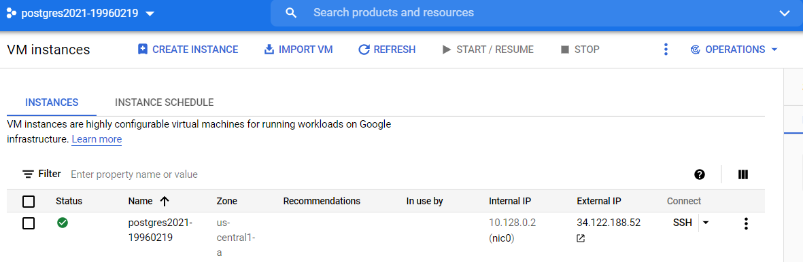
  - 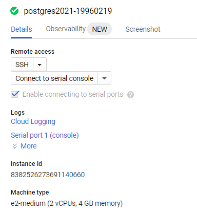
  - 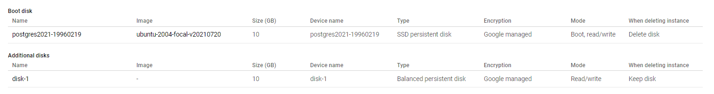

- установить на него PostgreSQL 13 с дефолтными настройками

  - 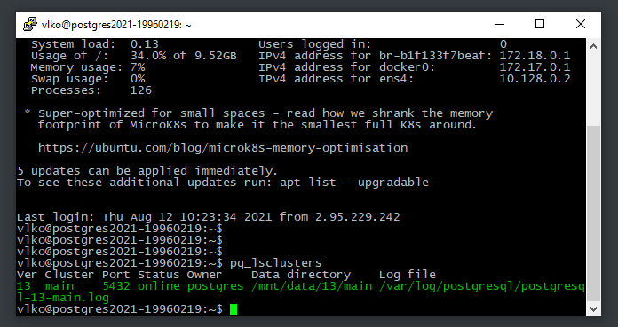

- применить параметры настройки PostgreSQL из прикрепленного к материалам занятия файла

  -  sudo nano /etc/postgresql/13/main/postgresql.conf

  - ```
    # DB Type: dw
    # Total Memory (RAM): 4 GB
    # CPUs num: 1
    # Data Storage: hdd
    
    max_connections = 40
    shared_buffers = 1GB
    effective_cache_size = 3GB
    maintenance_work_mem = 512MB
    checkpoint_completion_target = 0.9
    wal_buffers = 16MB
    default_statistics_target = 500
    random_page_cost = 4
    effective_io_concurrency = 2
    work_mem = 6553kB
    min_wal_size = 4GB
    max_wal_size = 16GB
    ```

  - 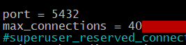

  - 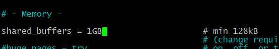

  - 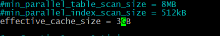

  - 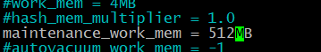

  - 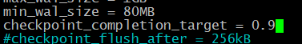

  - 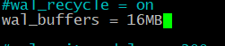

  - 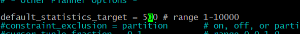

  - 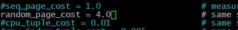

  - 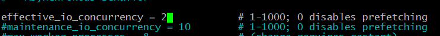

  - 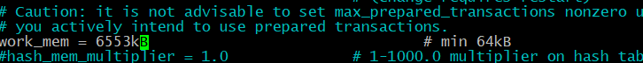

  - 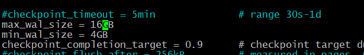

  - sudo pg_ctlcluster 13 main restart

- выполнить pgbench -i postgres

  - первом запуске столкнулся с проблемой 

  - 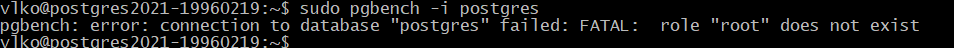

  - выполнил sudo -u postgres -i

  - и запустил pgbench -i postgres

  - 

  - ```
    postgres@postgres2021-19960219:~$  pgbench -i postgres
    Password:
    dropping old tables...
    creating tables...
    generating data (client-side)...
    100000 of 100000 tuples (100%) done (elapsed 0.10 s, remaining 0.00 s)
    vacuuming...
    creating primary keys...
    done in 0.53 s (drop tables 0.05 s, create tables 0.02 s, client-side generate 0.28 s, vacuum 0.10 s, primary keys 0.08 s).
    postgres@postgres2021-19960219:~$
    ```

    

- запустить pgbench -c8 -P 60 -T 3600 -U postgres postgres

  - воспользовался опцией и запустил на 20 минут pgbench -c8 -P 60 -T 1200 -U postgres postgres
  - 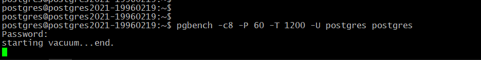

- дать отработать до конца
    - 

- зафиксировать среднее значение tps в последней ⅙ части работы

  - Среднее значение tps за 20 минут = 310.19

- а дальше настроить autovacuum максимально эффективно

  - воспользовался статьей https://aws.amazon.com/ru/blogs/database/a-case-study-of-tuning-autovacuum-in-amazon-rds-for-postgresql/
  - 
  - результаты
  - 
  - среднее значение упало до 309.35

- так чтобы получить максимально ровное значение tps на горизонте часа

  - 

  - | Sec  | tps_defoult | tps_custom |
    | ---- | ----------- | ---------- |
    | 60   | 548,8       | 548,9      |
    | 120  | 299,3       | 299,3      |
    | 180  | 299,2       | 292,3      |
    | 240  | 296,4       | 297,8      |
    | 300  | 297,7       | 297,7      |
    | 360  | 297,8       | 297,5      |
    | 420  | 297,6       | 298        |
    | 480  | 297,7       | 293        |
    | 540  | 296,8       | 297,9      |
    | 600  | 297,7       | 297,8      |
    | 660  | 297,8       | 297,3      |
    | 720  | 297,3       | 297,7      |
    | 780  | 297,6       | 293        |
    | 840  | 297,2       | 297,9      |
    | 900  | 297,8       | 297,8      |
    | 960  | 297,7       | 297,3      |
    | 1020 | 297,1       | 297,9      |
    | 1080 | 297,5       | 292,8      |
    | 1140 | 297,1       | 297,4      |
    | 1200 | 297,7       | 297,7      |

